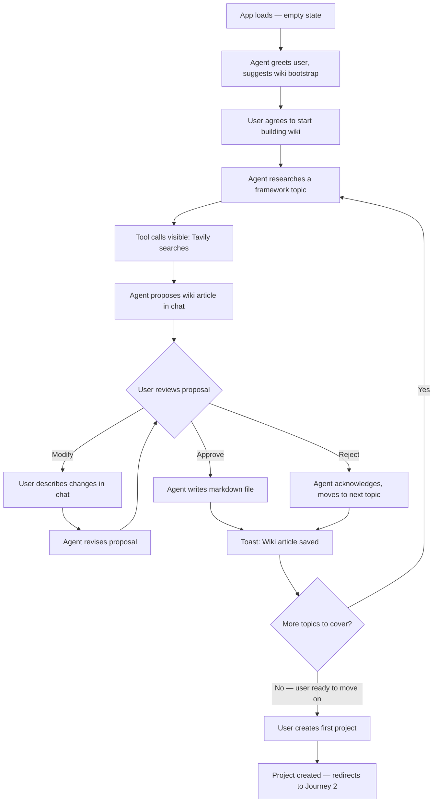
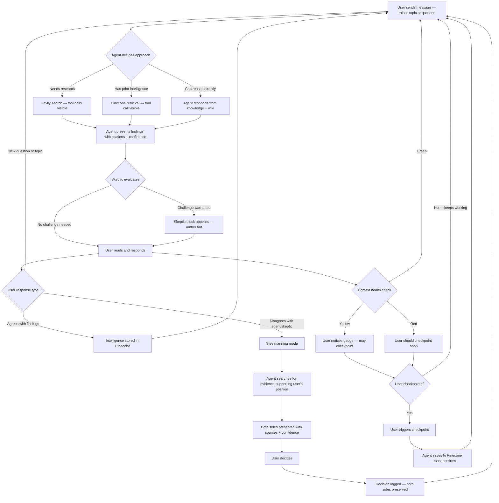
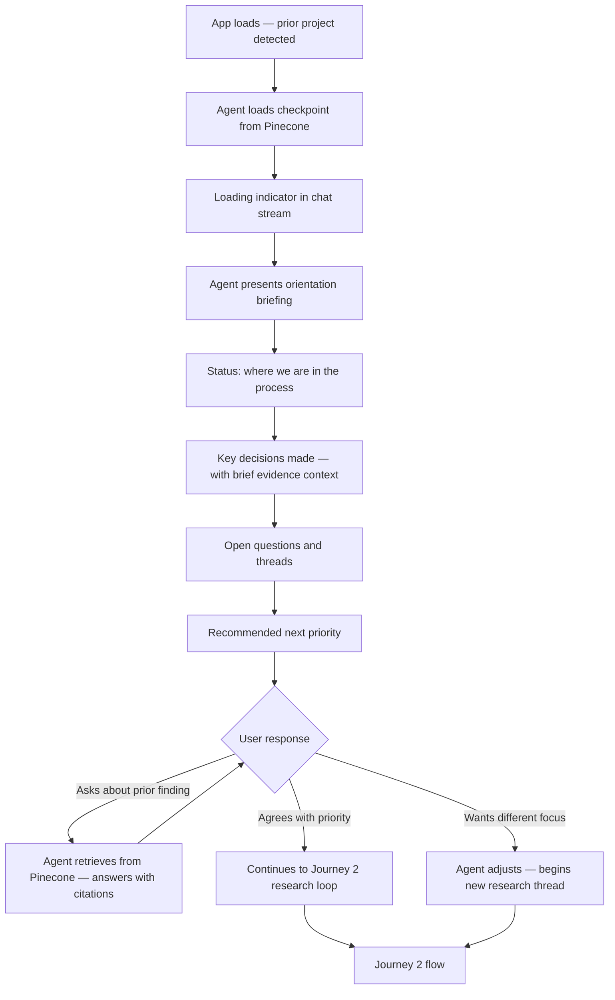

# UX Design Specification - Business Planner

**Author:** Downe
**Date:** 2026-04-17

---

## Executive Summary

### Project Vision

Business Planner is a chat-driven AI workbench for a single user to research, challenge, and plan businesses across multiple ventures. The UX serves one interaction model — conversational collaboration with an adversarial AI agent — augmented by a methodology wiki, durable memory, and transparent agent process visibility. Desktop-only, Chrome-only, optimized for deep multi-hour work sessions.

### Target Users

Single user (Downe). Solo founder, technically intermediate, high tenacity. Prioritizes process quality and code quality over speed. Multitasks during long agent research runs. Expects transparent agent behavior — visible thinking, tool calls, and skeptic input. Sessions span hours to full days, across multiple days with checkpoint/resume cycles.

### Key Design Challenges

- **Multi-voice chat stream:** Primary agent, skeptic sub-agent, tool calls, thinking steps, and steelmanning exchanges must be visually distinct without creating visual noise. The skeptic must be noticeable but not disruptive.
- **Context health gauge:** Communicate a gradient status (green/yellow/red) as a glanceable background signal that becomes actionable when attention is needed. Must convey both current state and recommended action.
- **Wiki as side channel:** Reference material coexists with conversational flow. The user needs to browse, read, and approve/modify wiki content without breaking the dialogue interaction mode.
- **Transparency without overwhelm:** Visible thinking and tool calls during multi-step research runs can produce a wall of intermediate output. Expandable/collapsible sections need sensible defaults for what starts open vs. closed.

### Design Opportunities

- **Decision log as first-class UI:** Intelligence preservation ("you decided X despite evidence for Y") can be surfaced as structured, retrievable records — not buried in chat history. This makes the adversarial stance feel valuable rather than combative.
- **Session resume as trust moment:** The agent's first display after days away — demonstrating what it remembers — is the highest-stakes moment for building user trust in the memory system.
- **Wiki bootstrap as onboarding:** The empty wiki turns a cold-start problem into a guided, productive first activity. Co-building the wiki IS the onboarding.

## Core User Experience

### Defining Experience

The core interaction is the **conversational research loop**: user raises a topic → agent researches → findings appear with sourced citations → skeptic challenges → user engages with both sides → intelligence is stored. This loop repeats dozens of times per session across hours of deep work. Every UX decision optimizes for the clarity and parsability of this loop.

The user is not passively consuming — they are actively evaluating evidence quality, weighing the skeptic's challenges, and making decisions. The UI must support critical reading, not just message display.

### Platform Strategy

- Desktop web SPA, Chrome-only, mouse/keyboard
- Optimized for wide-screen layout — chat is the primary surface, with wiki and project context as secondary panels
- No mobile, no responsive design, no offline capability
- Long sessions (hours to full days) — the UI must remain comfortable and performant over extended use
- User multitasks during agent research runs — the tool should not demand constant attention

### Effortless Interactions

**Session resume must require zero thought.** After days away, the user opens the tool and the agent demonstrates what it knows — summary of prior work, key decisions, open questions, accumulated intelligence. The user should never need to re-explain context or remind the agent what they were working on. This is the single most important "effortless" moment.

**Reading agent output must be effortless.** The user must instantly distinguish: primary agent response, skeptic challenge, tool call activity, research findings with citations, and steelmanning arguments. Visual differentiation must be obvious at a glance, not requiring careful reading to determine "who is speaking."

**Source verification must be effortless.** Every research finding includes a citation. Clicking or hovering reveals the source. The user should never have to ask "where did you get this?"

### Critical Success Moments

**"The skeptic caught something I missed."** The first time the skeptic surfaces a genuine blind spot — not a generic "have you considered..." but a specific, evidence-backed challenge that changes the user's thinking — the tool proves its value. This moment validates the entire adversarial architecture.

**"The plan is getting stronger."** The cumulative effect of research, challenge, and evidence accumulation visibly strengthens the business plan over sessions. The user feels the intelligence compounding — not just more data, but better-connected, more rigorously tested thinking.

**"It remembers."** After days away, the agent recalls specific findings, decisions, and their evidence context. This is the trust-building moment for the entire memory system. If this fails, confidence in the tool collapses.

### Experience Principles

1. **Evidence is first-class.** Every insight has a source. Every source has a confidence level. Confidence cascades — a finding drawn from a peer-reviewed study carries different weight than one from an anonymous blog post. The UI makes this chain visible and auditable without requiring extra clicks.

2. **Transparency over polish.** Show the agent's work — thinking, tool calls, research queries, skeptic reasoning. The user trusts the process because they can see it, not because the output looks clean. Collapsible detail sections let the user choose their depth.

3. **Resume is the trust test.** Session resume is not a feature — it is the moment where the tool earns or loses the user's confidence. Design it as the highest-stakes interaction, not an afterthought.

4. **Challenge strengthens, not obstructs.** The skeptic's pushback must feel like it's making the plan better, not blocking progress. Visual treatment of skeptic input should convey "rigorous peer" not "error message."

5. **Deep work, not notification work.** The tool supports hours of focused thinking. No distractions, no unnecessary alerts, no UI elements competing for attention. The context health gauge is the only persistent status element — everything else serves the conversational flow.

## Desired Emotional Response

### Primary Emotional Goals

**Grounded confidence.** The primary emotional state during use. The user's thinking is getting sharper, decisions rest on evidence, and the plan is becoming more defensible with each session. This is not excitement or delight — it is the steady accumulation of justified conviction.

**Intellectual partnership.** The agent feels like a sharp, direct colleague who does real work — not an assistant waiting for instructions. The skeptic's challenges feel like a peer pushing back in a design review, not a warning dialog.

### Emotional Journey Mapping

| Stage | Desired Feeling | Design Implication |
|-------|----------------|-------------------|
| First launch (wiki bootstrap) | Productive momentum — building something useful from minute one | Guided first activity, no empty-state paralysis |
| Deep research session | Focused flow — evidence accumulating, thinking sharpening | Minimal UI distractions, transparent agent work, no interruptions |
| Skeptic challenge | "Good catch" — direct, specific, welcome | Direct language, no hedging or softening, evidence-first presentation |
| Steelmanning disagreement | Respected — the agent takes my position seriously enough to find evidence for it | Both sides presented with equal rigor, no patronizing tone |
| Checkpointing | Quick and done — a 2-second task, not a ceremony | One action, confirmation, move on |
| Return after days away | Re-orientation — "where are we, what's next" | Agent leads with status summary: progress, decisions, open threads, next priority |
| Finding something from a prior session | Trust confirmed — it's all there | Specific recall with citations, not vague summaries |

### Micro-Emotions

**Critical to get right:**
- **Trust over doubt.** Every cited source, every recalled decision, every specific skeptic challenge builds trust. One hallucinated statistic or forgotten finding erodes it.
- **Challenged over obstructed.** The skeptic must feel like it's sharpening the plan, not blocking progress. Direct is good. Generic is bad.
- **Oriented over anxious.** After a break, the user needs to know where things stand — not wonder whether the memory worked. The agent proactively orients.

**Actively avoid:**
- **Doubt in intelligence quality** — generic pushback, shallow research, or unsourced claims
- **Tedium** — wiki management, checkpointing, or project switching feeling like chores
- **Memory anxiety** — uncertainty about whether a checkpoint saved or whether the agent will remember

### Design Implications

- **Skeptic tone: direct, not diplomatic.** No "you might want to consider..." or "it's worth noting that..." — state the challenge plainly: "The evidence doesn't support this. Here's why." The user is a software engineer who reads directness as respect.
- **Resume experience: orientation-first.** On return, the agent leads with: where we are in the process, what's been completed, what's outstanding, and recommended next priority. Not a warm welcome — a status briefing.
- **Checkpoint UX: minimal friction.** One click or command. Confirmation appears. Done. No wizard, no options dialog, no "what would you like to save?"
- **Evidence presentation: confidence-forward.** Source type and confidence level visible alongside every finding. The user calibrates trust by reading evidence quality, not by trusting the agent's synthesis blindly.
- **Error states: honest and actionable.** If Tavily fails, say "research unavailable — Tavily returned an error." If Pinecone write fails, say "checkpoint failed — retry?" No euphemisms, no vague "something went wrong."

### Emotional Design Principles

1. **Directness is respect.** Never soften, hedge, or cushion communication. State findings, challenges, and status plainly. The user interprets indirectness as the tool being unsure of itself.
2. **Orient, don't reassure.** After a break, the user needs coordinates — where we are, what's next — not comfort that the memory works. Show, don't tell.
3. **Silence discomfort comes from agreement, not disagreement.** The user feels most uneasy when ideas go unchallenged. The absence of skeptic pushback should feel like a gap, not a relief.
4. **Utility earns trust.** No onboarding tour, no tooltips, no hand-holding. The tool earns trust by doing useful work immediately — the wiki bootstrap is the onboarding, and it produces real output.
5. **Invisible infrastructure.** Checkpointing, Pinecone writes, wiki retrieval, context management — all of this should be nearly invisible. The user's attention stays on the intellectual work, not the plumbing.

## UX Pattern Analysis & Inspiration

### Inspiring Products Analysis

**Claude Code / terminal-based AI tools** — The interaction model where you type, the agent works visibly (streaming output, tool calls), and results appear inline. No navigation, no mode-switching, no chrome competing for attention. The chat IS the product. Business Planner's core loop follows this pattern.

**Perplexity** — Source citation inline with findings. Every claim has a numbered reference. The user can verify without leaving the flow. This is the closest existing pattern for the evidence-first presentation Business Planner needs — but Perplexity has no opinion, no challenge, no memory. We borrow the citation UX, not the interaction model.

**VS Code** — A tool for deep, multi-hour work sessions. Sidebar panels (file explorer, search, extensions) coexist with the primary editor without competing for attention. Panels collapse when not needed. Status bar at the bottom provides glanceable info (branch, errors, line number) without interrupting flow. This is the structural model for chat + wiki + project context coexistence.

**GitHub PR reviews** — Inline comments on specific content, visually distinct from the content itself. Different authors have different visual treatments. Threaded discussion on a specific point without leaving the main view. This is the closest pattern for how the skeptic's inline challenges should feel — a review comment on the agent's work, not a separate conversation.

### Transferable UX Patterns

**Chat-first, panels-second (VS Code model):**
- Primary surface: chat stream, full width when panels are closed
- Collapsible side panel for wiki browsing, project switching, decision log
- The user opens the panel when they need reference material, closes it to focus on conversation
- Applies to: wiki as side channel, project management

**Inline citation (Perplexity model):**
- Source references appear as numbered links or tags alongside findings
- Clicking/hovering reveals source details (URL, source type, confidence)
- Confidence level indicated by visual treatment (color, icon, or label)
- Applies to: evidence-first presentation, source verification

**Inline review comments (GitHub PR model):**
- Skeptic challenges appear as visually distinct blocks within the chat stream
- Different visual treatment from primary agent (border, background, icon) — but not a separate panel or popup
- The skeptic's input is part of the conversation flow, not an interruption
- Applies to: skeptic sub-agent display, steelmanning exchanges

**Collapsible detail sections (Claude Code model):**
- Thinking and tool call details collapsed by default
- Expand to see the agent's reasoning process on demand
- Final response always visible — intermediate work is opt-in
- Applies to: transparency without overwhelm

**Status bar (VS Code model):**
- Persistent, minimal bar showing glanceable status: context health gauge, active project, session cost
- Never demands attention — always available at a glance
- Applies to: context health gauge, cost visibility, project indicator

### Anti-Patterns to Avoid

- **Dashboard-first layouts.** Business Planner is not a dashboard product. No cards, no widgets, no overview screens. The chat is the entry point and the primary surface. Everything else is secondary.
- **Modal dialogs for routine actions.** Checkpointing, project switching, and wiki proposals should never pop up a modal. Inline confirmations or toast notifications only.
- **Wizard-style onboarding.** No step-by-step tour, no feature highlights, no "click here to learn about..." The wiki bootstrap IS the onboarding — it produces real output immediately.
- **Notification badges and attention magnets.** No red dots, no unread counts, no "you have 3 new findings." The tool waits for the user's attention — it doesn't compete for it.
- **Split-pane chat.** Don't put the skeptic in a separate column or panel alongside the primary agent. This fragments reading flow and forces the user to context-switch between two streams. Inline is the right pattern — one stream, multiple voices.

### Design Inspiration Strategy

**Adopt:**
- Chat-first single-stream interface with collapsible side panels
- Inline numbered citations with confidence indicators
- Collapsible thinking/tool-call detail sections (collapsed by default)
- Persistent minimal status bar for context health and project info

**Adapt:**
- GitHub PR inline comments → skeptic inline challenges (same visual pattern, different context: review comments on agent findings rather than code)
- VS Code sidebar → wiki/project panel (simpler — fewer panel types, less chrome)

**Avoid:**
- Dashboard layouts, modal dialogs, wizard onboarding, notification badges, split-pane chat

## Design System Foundation

### Design System Choice

**Tailwind CSS + shadcn/ui** — utility-first CSS framework with a copy-paste component library for React.

### Rationale for Selection

- **Solo developer, no designer.** shadcn/ui provides clean, minimal defaults that look professional without design expertise. Components are visually understated — aligned with the "don't notice it" UX philosophy.
- **Copy-paste, not dependency.** shadcn/ui components are copied into the project as source code, not installed as an npm package. Full ownership, full modification ability, no version lock-in or breaking updates.
- **Minimal component surface.** A chat-first tool needs fewer than 10 component types. shadcn/ui lets you install only what you use — no bloated bundle from an enterprise component library.
- **Tailwind for rapid iteration.** Utility classes eliminate context-switching between component code and CSS files. Fast iteration for a solo dev who wants to spend time on agent logic, not styling.

### Implementation Approach

- Install Tailwind CSS during project setup
- Add shadcn/ui components as needed during development — start with: Card, Collapsible, Tooltip, Sheet, Progress, Badge, Toast, ScrollArea
- Configure shadcn/ui in dark mode only — no light mode, no theme toggle, no dual-palette maintenance
- Define a minimal dark color palette: dark neutral base, accent color for primary agent, distinct color for skeptic blocks, green/yellow/red for context health gauge
- No custom theme beyond palette — use shadcn/ui dark defaults for spacing, typography, borders

### Customization Strategy

**Minimal customization — dark defaults-first:**
- Dark mode only — single palette, no toggle, no light mode styles to maintain
- Override only colors (palette for agent voices, confidence levels, health gauge) against a dark background
- Typography: system font stack, no custom fonts — fast loading, familiar rendering
- Spacing and layout: Tailwind defaults unless a specific component needs adjustment
- Ensure sufficient contrast for long reading sessions — dark backgrounds with muted text tones that don't cause eye strain over hours of use

**Custom components (not in shadcn/ui):**
- Chat message bubble with voice differentiation (primary agent vs. skeptic vs. system)
- Inline citation tag with confidence indicator
- Context health progress bar with graduated color (green → yellow → red)
- Streaming token display component

## Core Interaction Design

### Defining Experience

"Ask a question, get researched evidence with cited sources, get challenged on your assumptions, make a better decision." This is the one-sentence description of the core loop. Everything in the UI exists to make this loop clear, parsable, and trustworthy.

### User Mental Model

The user's mental model is a **working session with a sharp research partner** — not a search engine, not a chatbot, not a form to fill out. The user thinks in terms of topics, questions, and decisions — not in terms of tools, APIs, or memory systems. The infrastructure (Pinecone, Tavily, wiki retrieval) should be invisible in the mental model, visible only in the transparency layer for users who want to verify the process.

**Current approach the user is coming from:** Claude Projects, ChatGPT, Perplexity — all conversational, all chat-based. The mental model of "type a message, get a response" is already established. Business Planner extends this with visible research process, inline challenge, and durable memory — but the fundamental interaction paradigm is familiar.

### Success Criteria

- The user can follow a multi-step research response without losing track of which voice is speaking (agent vs. skeptic)
- Source citations are immediately verifiable — one click opens the source URL
- The user never wonders "where did this come from?" — every factual claim traces to evidence
- The skeptic's challenges feel earned — selective enough that each appearance carries weight
- After a disagreement + steelmanning exchange, the user can clearly see both positions and knows the decision was logged
- Session resume feels like picking up a conversation with a colleague who took good notes

### Research Initiation

The agent decides autonomously when to research vs. respond from existing knowledge. The user does not explicitly request "research this" — they ask questions or raise topics, and the agent determines whether web research, Pinecone retrieval, wiki consultation, or direct reasoning is appropriate. The user sees the agent's decision via the transparency layer: tool calls show "Searching Tavily for: [query]" or "Retrieving from Pinecone: [topic]" in collapsible detail sections.

### Skeptic Activation Model

The skeptic is always-on but **selective** — it earns its voice by speaking only when something genuinely deserves scrutiny.

**Triggers (skeptic speaks up):**
- Unsupported claims — a statement presented as fact without evidence or with weak/single-source evidence
- Assumption leaps — a conclusion that skips logical steps without supporting data
- Contradictions with prior intelligence — a position that conflicts with established findings in the knowledge repository
- High-stakes decisions with low-confidence data — the decision matters but the evidence is thin
- Pattern repetition from prior projects — via wiki, the skeptic recognizes an assumption that proved wrong before

**Silent (skeptic stays quiet):**
- Agent presenting well-sourced, high-confidence research
- User asking questions or directing research (not making claims)
- Procedural conversation (wiki management, checkpointing, project switching)

**Calibration principle:** If the skeptic challenges everything, the user tunes it out. Selectivity is what makes each challenge carry weight.

### Steelmanning Mechanics

Steelmanning is triggered conversationally — no button, no explicit command. When the user expresses disagreement with the agent's evidence-based position, the agent recognizes the pushback from natural language and enters steelmanning mode.

**Flow:**
1. Agent presents evidence-backed position
2. User disagrees (natural language — "I disagree," "that's not how I see it," "I'm going to do X anyway")
3. Agent searches for the strongest evidence supporting the user's position
4. Agent presents both sides with sources and confidence levels
5. User decides
6. Decision is logged with full evidence context on both sides — including a note if the decision goes against the stronger evidence

**The user reserves the right to override evidence.** The plan proceeds based on the user's decision, but the decision log preserves the record: "User chose X. Evidence supported Y. Rationale: [user's stated reason]." This is an accountability feature, not a punishment — it enables future review.

### Citation Interaction

- Every research finding displays an inline citation (numbered reference or tag)
- Clicking a citation opens the source URL in a new browser tab
- Citations include a confidence indicator (visual badge or color) reflecting source type and reliability
- Confidence cascades: source quality affects finding confidence, which affects any conclusions drawn from it
- Nice-to-have: hover preview showing source type, URL, and confidence level before clicking

### Novel UX Patterns

**Mostly established, with targeted innovations:**

- **Established:** Chat interface, streaming responses, collapsible sections, sidebar panels, progress bars — all familiar patterns the user already knows from dev tools and AI chat products
- **Novel combination:** Multi-voice chat stream (agent + skeptic + tool calls in one flow) — no existing product combines these exactly this way. The GitHub PR inline-comment pattern is the closest analog, adapted for real-time conversation
- **Novel:** Confidence-cascading citations — showing how source quality propagates through the intelligence chain. Perplexity cites sources but doesn't display confidence levels or show how evidence quality affects conclusions
- **Novel:** Decision log as auditable record — "you decided X despite evidence for Y" as a first-class retrievable artifact, not buried in chat history

No new interaction paradigms need to be taught. The user already knows how to chat, click links, and expand/collapse sections. The novelty is in what information is presented and how it's visually differentiated — not in how the user interacts with it.

## Visual Design Foundation

### Color System

**Dark theme only.** No light mode, no theme toggle.

**Base palette:**
- **Background:** Dark neutral (zinc-900/slate-900 range — `#18181b` to `#1e293b`). Not pure black — pure black causes eye strain over long sessions. Dark gray provides depth for layering.
- **Surface:** Slightly lighter than background for cards, panels, and elevated elements (zinc-800 range — `#27272a`). Creates subtle depth without strong contrast.
- **Text primary:** Off-white (`#e4e4e7` zinc-200 range). Not pure white — reduces glare on dark backgrounds during long reading sessions.
- **Text secondary:** Muted gray (`#a1a1aa` zinc-400 range) for metadata, timestamps, tool call details.
- **Border:** Subtle dark border (`#3f3f46` zinc-700 range) for separating sections without visual noise.

**Semantic colors:**
- **Primary accent:** Blue (tailwind blue-400/500 range) — links, user message highlights, interactive elements
- **Skeptic voice:** Amber/orange (amber-400/500 range) — distinct from primary agent without implying error. Warm tone conveys "peer challenge" not "warning"
- **Agent voice:** No special color — default text on default surface. The agent is the baseline; everything else is differentiated from it
- **Citations/sources:** Cyan or teal (cyan-400 range) — distinct from both primary accent and skeptic, visually associated with "reference material"
- **Confidence levels:** Green (high) → Yellow (medium) → Red (low) — using the same graduated scale as the context health gauge for consistency
- **Context health gauge:** Green → Yellow → Red gradient on a progress bar
- **Success/confirmation:** Green (emerald-400) — checkpoint saved, wiki updated
- **Error/failure:** Red (red-400) — API failures, write errors
- **Tool calls/thinking:** Muted text (zinc-500) — present but not competing for attention

### Typography System

**System font stack only:** `-apple-system, BlinkMacSystemFont, "Segoe UI", Roboto, sans-serif`. No custom fonts, no loading delay, consistent with OS rendering.

**Monospace for code/technical content:** `"Fira Code", "Cascadia Code", "JetBrains Mono", "Consolas", monospace` — for any code snippets, JSON, or technical data the agent surfaces.

**Type scale (tight, IDE-like):**

| Element | Size | Weight | Line Height |
|---------|------|--------|-------------|
| Page title | 20px | 600 | 1.3 |
| Section header | 16px | 600 | 1.3 |
| Body / chat messages | 15px | 400 | 1.5 |
| Skeptic text | 15px | 400 | 1.5 |
| Tool calls / thinking | 13px | 400 | 1.4 |
| Citations / badges | 12px | 500 | 1.3 |
| Status bar | 12px | 400 | 1.3 |

### Spacing & Layout Foundation

**Density: IDE-like — compact but readable.**

**Base unit:** 4px. All spacing is multiples of 4px.

| Context | Spacing |
|---------|---------|
| Between chat messages | 8px (2 units) |
| Inside message bubble padding | 12px (3 units) |
| Between sections within a message | 8px |
| Sidebar panel padding | 12px |
| Status bar height | 32px |
| Input area padding | 12px |

**Layout structure:**
- Chat stream: fluid width, expands to fill available space when sidebar is closed
- Sidebar panel: fixed width (~320px), collapsible, overlays or pushes chat content (to be determined in layout step)
- Status bar: fixed bottom or top, full width, 32px height
- Input area: fixed bottom, full width, auto-expanding textarea

**Content width:** Chat messages should have a max-width (~800px) centered in the stream to prevent ultra-wide lines on large monitors. Keeps reading comfortable without responsive breakpoints.

### Accessibility Considerations

**Relevant for this project (single user, long sessions):**
- Contrast ratios: WCAG AA minimum (4.5:1 for body text) on dark backgrounds — not for compliance, but because insufficient contrast causes eye strain over hours
- No pure black backgrounds, no pure white text — both cause fatigue
- Semantic HTML throughout — standard browser keyboard navigation works without custom implementation
- Focus indicators: default browser focus styles are sufficient (Chrome-only)

**Not relevant (single user, no distribution):**
- Screen reader optimization
- WCAG AAA compliance
- Color-blind–specific palette adjustments (though the amber/blue/cyan separation naturally works for most forms of color blindness)
- Reduced motion preferences

## Design Direction Decision

### Design Directions Explored

Three layout directions were evaluated using an interactive HTML mockup (ux-design-directions.html) with realistic content from the radio app competitive research journey:

- **Direction A:** Push sidebar (takes space from chat), top status bar, left-border skeptic accent
- **Direction B:** Overlay sidebar (floats over chat), bottom status bar, background-tint skeptic
- **Direction C:** No sidebar (info in status bar), bottom status bar, icon + badge skeptic

### Chosen Direction

**Direction B: Overlay sidebar + bottom status bar + background-tint skeptic.**

### Design Rationale

- **Overlay sidebar:** Chat stream maintains full width at all times. The sidebar floats over the chat when opened — no content reflow, no layout shift. The user opens the Intelligence / Skeptic / Wiki / Decisions / History panel when needed and closes it to return to full-width chat. This matches the "side channel" design challenge: reference material is accessible but never competes with the primary conversational flow. (Project switching is a `ProjectSwitcher` dropdown in the status bar, not a sidebar tab.)
- **Bottom status bar:** Keeps the top of the viewport clean for reading. The status bar (project name, context health gauge, session cost) sits at the bottom like VS Code's status bar — always visible, never in the way. The context health gauge is glanceable without looking away from the chat content.
- **Background-tint skeptic:** Subtle amber wash distinguishes the skeptic from the primary agent without the visual weight of a hard border. Reads as "different voice" not "warning" — aligned with the "challenge strengthens, not obstructs" emotional principle. Noticeable at a glance when scanning the chat stream, but doesn't dominate.
- **Toast notifications for confirmations:** Checkpoint saves, wiki updates, and other background operations confirm via a small toast at the bottom-right. No modal, no inline status message — confirms and disappears.

### Implementation Approach

**Layout structure:**
- Full-width chat stream with max-width (800px) centered content
- Overlay sidebar (320px, left-positioned, z-indexed above chat) with shadow for depth
- Sidebar toggle in the bottom status bar (hamburger icon) and optionally in a minimal top bar
- Bottom status bar (32px) with: sidebar toggle, project name, context health gauge with percentage, session cost
- Fixed-bottom input area with auto-expanding textarea and send button

**Sidebar tabs:**
- Wiki — browsable article list with categories
- Projects — project list with active indicator
- Decisions — decision log entries with evidence summaries

**Skeptic treatment:**
- Background tint: `#78350f18` (amber at ~9% opacity) with subtle amber border (`#f59e0b30`)
- Rounded corners (6px) to differentiate from agent messages (no container) and user messages (blue tint)
- "Skeptic" label in amber (`#f59e0b`)

**Tool calls:**
- Collapsed by default — single line showing action ("Searching Tavily for: ...")
- Click to expand details (query, results count, timing)
- Muted text color (`#71717a`) — present but not competing for attention

**Decision log entries:**
- Blue-tinted container (`#1a1a2e`) with blue border — visually distinct from both agent and skeptic
- Header with clipboard icon and "Decision Logged" label
- Body showing the decision, with amber warning line if decision goes against evidence

## User Journey Flows

### Journey 1: First Launch — Wiki Bootstrap

**Entry point:** User opens the app for the first time. No wiki content, no projects, empty Pinecone.

**Screen states:**

1. **Empty state:** Chat stream with agent's opening message. No sidebar content (wiki is empty). Status bar shows no project active.
2. **Research in progress:** Tool call rows appear (collapsed) as agent searches. User can expand to see queries.
3. **Wiki proposal:** Agent presents proposed article content in a standard agent message. User responds in chat (approve/modify/reject).
4. **Wiki growing:** Sidebar wiki tab populates as articles are saved. User can open sidebar to browse accumulated articles.
5. **First project creation:** User types something like "let's start on the radio app" — agent creates a project, status bar updates with project name.

**Key UX decisions:**
- No special onboarding UI. The agent drives the bootstrap conversationally.
- Wiki proposals appear as regular chat messages — no special approval widget. The user approves/rejects in natural language.
- Toast confirms each wiki save. No inline confirmation cluttering the chat.
- The sidebar wiki tab fills up visibly during the session — progress is tangible.

### Journey 2: Deep Research Session

**Entry point:** User has an active project and opens the app (or continues from Journey 1/3).

**Screen states:**

1. **Active research:** Tool call rows stream in as the agent works. Chat stream shows the agent's process.
2. **Findings with citations:** Agent message with inline citation tags (cyan, numbered). Confidence badges (green/yellow/red) next to findings.
3. **Skeptic challenge:** Amber-tinted block appears in the chat stream after the agent's findings. Same flow — no mode switch.
4. **Steelmanning:** Agent labels its response "Steelmanning your position." Presents "For" and "Against" sections with citations for both.
5. **Decision logged:** Blue-tinted decision log block appears in chat. Amber warning line if decision goes against evidence.
6. **Checkpoint:** User clicks checkpoint button (or types a command). Toast appears: "Checkpoint saved — [topic summary]."
7. **Context gauge:** Progress bar in status bar transitions from green through yellow to red as context fills. Percentage label updates.

**Key UX decisions:**
- The agent decides whether to research, retrieve, or reason — no explicit "research this" command from the user.
- Skeptic blocks appear inline in the same chat stream, not in a separate panel.
- Steelmanning is conversational — triggered by natural language disagreement, not a button.
- Context health gauge is passive until yellow/red — no alerts, no popups. The user glances at it when they want to.
- Checkpoint is one action — button or command. Toast confirms. No wizard.

### Journey 3: Session Resume

**Entry point:** User opens the app after hours or days away. Active project exists with checkpoint data.

**Screen states:**

1. **Loading:** Brief loading indicator while checkpoint and Pinecone retrieval complete (target: under 15 seconds per NFR13). Chat stream shows "Resuming session..."
2. **Orientation briefing:** Agent's first message is a structured status update — not a greeting, not a summary of everything. Formatted sections: progress, decisions, open questions, next priority.
3. **Probing memory:** If the user asks about a specific prior finding, the agent retrieves and answers with citations. Tool call row shows "Retrieving from Pinecone: [topic]."
4. **Transition to research:** Once oriented, the user directs the next topic and the flow transitions to Journey 2.

**Key UX decisions:**
- The agent leads with orientation, not warm-up. "Here's where we are" — not "Welcome back!"
- The briefing is structured but concise — not a wall of text. Sections are scannable.
- The user can probe memory immediately — "what did we find about X?" — and get a cited answer. This is the trust test.
- No special "resume mode" UI. The chat stream looks the same as any session. The orientation briefing is just the first message.

### Journey 4: New Venture

Journey 4 follows the same UX flow as Journey 2, preceded by a project switch:

1. User opens sidebar → Projects tab → creates new project (name/projectId)
2. Status bar updates with new project name
3. Pinecone namespace is fresh — no prior intelligence
4. Wiki carries over — all articles from prior projects are available
5. Agent behavior is visibly informed by wiki (references methodology articles, applies learned patterns)
6. Research loop proceeds as Journey 2

The UX difference is not in the flow but in the agent's behavior — wiki-influenced responses, cross-project pattern recognition in skeptic challenges. The UI surfaces this naturally through the existing chat stream; no special visual treatment is needed for "wiki-influenced" vs. "non-wiki-influenced" responses.

### Journey Patterns

**Patterns consistent across all journeys:**

- **Chat is the only interaction surface.** Every journey happens through the chat stream. The sidebar, status bar, and toasts are supplementary — never required to complete a task.
- **Agent-initiated structure.** The agent proposes next steps, suggests topics, recommends checkpoints. The user directs and decides, but the agent provides structure so the user doesn't have to manage the process.
- **Inline everything.** Skeptic challenges, decision logs, tool calls, wiki proposals — all appear in the chat stream. No popups, no modals, no separate views for critical interactions.
- **Toast for background confirmations.** Wiki saves, checkpoint confirms, Pinecone writes — all confirmed via toast. The chat stream stays clean for intellectual content.

### Flow Optimization Principles

- **Zero-step onboarding.** No tour, no setup wizard. The agent's first message IS the onboarding — it suggests building the wiki, and the user is doing productive work within 30 seconds.
- **One-action checkpoint.** Save context with one click or command. No options, no "what would you like to save?" The agent decides what to include in the checkpoint.
- **Orientation over recap.** On resume, the agent provides coordinates (where, what's next) not a replay of everything that happened. The user asks for details if they want them.
- **Graceful context pressure.** The health gauge is passive feedback, not an alarm. Yellow means "you have room but consider saving soon." Red means "checkpoint recommended." Neither interrupts the flow.

## Component Strategy

### Design System Components (shadcn/ui)

Components used directly from shadcn/ui with minimal customization:

| Component | Usage | Customization |
|-----------|-------|---------------|
| **Card** | User message container, agent message container | Dark theme colors only |
| **Collapsible** | Tool call expand/collapse, thinking sections | Chevron icon, muted styling |
| **Tooltip** | Citation hover previews (nice-to-have) | Dark theme, cyan accent |
| **Sheet** | Overlay sidebar panel | Left-positioned, 320px, shadow |
| **Progress** | Context health gauge | Custom gradient (green→yellow→red) |
| **Badge** | Confidence levels, citation tags, skeptic label | Custom color variants per semantic meaning |
| **Toast** | Checkpoint confirmation, wiki save, error notifications | Position: bottom-right, auto-dismiss |
| **ScrollArea** | Chat stream, sidebar content | Dark scrollbar styling |
| **Tabs** | Sidebar tab switching (Intelligence/Skeptic/Wiki/Decisions/History) | Minimal underline style |
| **Button** | Send message, checkpoint, sidebar toggle | Minimal variants: primary (send), ghost (toggle, checkpoint) |
| **Textarea** | Chat input | Auto-expanding, dark theme |

### Custom Components

#### ChatMessage

**Purpose:** Renders a single message in the chat stream with appropriate visual treatment based on the message source.

**Variants:**

| Variant | Visual Treatment | Content |
|---------|-----------------|---------|
| `user` | Blue-tinted background (`#1e3a5f`), blue border, rounded | User's message text |
| `agent` | No background container, default text on page background | Agent response with inline citations and confidence badges |
| `skeptic` | Amber background tint (`#78350f18`), subtle amber border, rounded | Skeptic challenge with citations |
| `steelman` | Same as `agent` but with "Steelmanning your position" label | For/Against sections with citations |
| `decision` | Blue-tinted background (`#1a1a2e`), blue border | Decision summary + amber warning if against evidence |
| `system` | Centered, muted text, no container | "Resuming session...", loading indicators |

**Anatomy:**
- Label (source name — "You", "Agent", "Skeptic", etc.) in source-appropriate color
- Message body (markdown-rendered content)
- Inline citation tags and confidence badges within body
- Timestamp (optional, muted, right-aligned)

**States:** Default only — messages are immutable once rendered. No hover, no selection, no editing.

#### ToolCallRow

**Purpose:** Displays a single tool call (Tavily search, Pinecone operation, wiki write) in the chat stream, collapsed by default.

**Anatomy:**
- Chevron icon (▶ collapsed, ▼ expanded)
- Action summary text ("Searching Tavily for: [query]", "Storing findings → Pinecone")
- Expandable detail panel (query details, result count, timing, status)

**States:**
- Collapsed (default): single line, muted text (`#71717a`)
- Expanded: detail panel visible with monospace text, dark background (`#1a1a1e`)

**Interaction:** Click anywhere on the row to toggle. No other interactions.

#### CitationTag

**Purpose:** Inline reference marker linking a finding to its source.

**Anatomy:**
- Numbered tag (e.g., "1", "2") in cyan (`#22d3ee`) on dark cyan background (`#164e63`)
- Clickable — opens source URL in new tab

**States:**
- Default: cyan tag
- Hover: slightly lighter background (`#155e75`)

**Behavior:** Click opens source URL in new browser tab. Title attribute shows source description on hover (native browser tooltip — no custom tooltip needed for MVP).

#### ConfidenceBadge

**Purpose:** Displays confidence level for a finding or source.

**Variants:**

| Level | Background | Text | Label |
|-------|-----------|------|-------|
| High | `#14532d` | `#4ade80` | "high confidence" |
| Medium | `#713f12` | `#fbbf24` | "medium confidence" |
| Low | `#7f1d1d` | `#f87171` | "low confidence" |

**Anatomy:** Inline badge with text label. Appears after finding text, before the next sentence.

#### ContextHealthGauge

**Purpose:** Shows remaining context capacity as a graduated progress bar in the status bar.

**Anatomy:**
- Progress bar (120px wide, 6px tall) with gradient fill
- Percentage label next to bar
- Color transitions: green (100%–50%) → yellow (50%–25%) → red (below 25%)

**States:**
- Green: no action needed
- Yellow: "consider checkpointing soon" — label color changes to yellow
- Red: "checkpoint recommended" — label color changes to red

**No alerts, no popups.** The gauge is passive — the user checks it when they want to.

#### CheckpointButton

**Purpose:** Triggers a session checkpoint save to Pinecone.

**Placement:** Status bar, adjacent to the context health gauge.

**Anatomy:** Ghost button with save icon (e.g., floppy disk or download icon). Text label "Save" or icon-only to save space.

**States:**
- Default: ghost style, muted
- Hover: slightly highlighted
- Saving: brief loading spinner replaces icon
- Saved: toast appears at bottom-right confirming save

**Behavior:** Single click triggers checkpoint. Agent decides what to include. Toast confirms with topic summary ("Checkpoint saved — competitive analysis"). No confirmation dialog, no options.

#### StreamingTokenDisplay

**Purpose:** Renders agent response tokens as they arrive from the API.

**Behavior:**
- Tokens append to the current message as they stream in
- Cursor/caret indicator at the end of streaming text (blinking or subtle)
- Auto-scroll keeps the latest content visible
- When streaming completes, the message renders as a standard ChatMessage

**Performance:** Must handle rapid token arrival without jank. Virtual scrolling not needed for MVP (NFR14 targets 200+ messages).

### Component Implementation Strategy

**Build order aligned with journey priority:**

**Phase 1 — Core chat loop (Journeys 1 & 2):**
1. ChatMessage (all variants)
2. StreamingTokenDisplay
3. ToolCallRow
4. CitationTag + ConfidenceBadge
5. Chat input (Textarea + Button)

**Phase 2 — Infrastructure UI (Journey 2 continued):**
6. ContextHealthGauge
7. CheckpointButton
8. Toast (shadcn/ui, configured)
9. Status bar layout

**Phase 3 — Side panel (Journeys 1, 2, 4):**
10. Sheet sidebar with Tabs (Intelligence/Skeptic/Wiki/Decisions/History)
11. Wiki article list
12. ProjectSwitcher dropdown (status bar) with create/switch
13. Decision log list

**Rationale:** The chat loop must work before anything else matters. A user can research and get challenged without the sidebar, without the health gauge, without checkpointing. Build the core experience first, then layer infrastructure around it.

## UX Consistency Patterns

### Feedback Patterns

**Success feedback (toast):**
- Checkpoint saved, wiki article written, project created
- Bottom-right toast, green tint (`#14532d` background, `#4ade80` text), auto-dismiss after 4 seconds
- Brief message with context: "Checkpoint saved — competitive analysis" not just "Saved"

**Error feedback (toast):**
- API failures (Claude, Tavily, Pinecone), write failures
- Bottom-right toast, red tint (`#7f1d1d` background, `#f87171` text), persists until dismissed
- Actionable message: "Tavily search failed — retry?" with retry action, not just "Something went wrong"
- If the error is within the agent's response flow, the agent also reports it inline in the chat stream

**Warning feedback (inline):**
- Stale or contradictory intelligence retrieved from Pinecone
- Appears inline in the agent's response — not a toast, not a separate notification
- The agent flags it in natural language: "Note: this finding was stored 3 weeks ago and may be outdated"

**No info/notification pattern.** This tool does not surface informational notifications. The agent communicates everything through the chat stream. No badges, no unread counts, no "you have new findings."

### Loading & Empty States

**Chat stream loading (session resume):**
- Centered system message: "Resuming session..." with a subtle spinner
- Replaces the empty chat area during checkpoint + Pinecone retrieval
- Transitions to the agent's orientation briefing when ready

**Empty state (first launch):**
- No special empty state UI. The chat stream shows the agent's opening message immediately.
- The agent drives the bootstrap: "Let's build the wiki" — the empty state IS the onboarding

**Sidebar empty states:**
- Wiki tab with no articles: "No wiki articles yet. Start a conversation to build the wiki."
- Decisions tab with no decisions: "No decisions logged yet."
- Projects tab with no projects: "No projects yet. Create one to get started."
- Each includes a single-line prompt — no illustrations, no CTAs, no "getting started" guides

**Tool call in progress:**
- ToolCallRow appears immediately when the agent initiates a tool call
- Summary text visible while the call is in flight: "Searching Tavily for: [query]"
- No separate loading spinner — the row itself indicates activity
- When complete, the row is finalized (result count, timing added to detail panel)

### Navigation Patterns

**Sidebar toggle:**
- Hamburger icon (☰) in the status bar — single click opens/closes the overlay sidebar
- Sidebar opens from the left, overlays the chat, shadow for depth
- Click the ✕ button or click outside the sidebar to close
- No keyboard shortcut needed for MVP

**Sidebar tab switching:**
- Tabs at the top of the sidebar: Intelligence | Skeptic | Wiki | Decisions | History
- Active tab indicated by blue underline and text color
- Tab content loads immediately — no loading state (data is already in memory)
- Project switching is a `ProjectSwitcher` dropdown in the status bar (per UX-DR35), not a sidebar tab

**Project switching:**
- Projects tab in sidebar shows list of projects with active indicator
- Click a project to switch — status bar updates, chat stream clears, agent loads new context
- "New Project" action at the top of the project list — inline text input for project name, enter to create
- No confirmation dialog for switching — the checkpoint button is available if the user wants to save first

### Button Hierarchy

**Primary action (blue, filled):** Send message button only. One primary action per view.

**Ghost actions (no background, muted text):**
- Checkpoint button (status bar)
- Sidebar toggle (status bar)
- Tool call expand/collapse
- Sidebar close button

**No secondary buttons, no destructive buttons, no button groups.** The UI has very few clickable elements — the chat input and send button are the primary interaction. Everything else is a ghost action that stays out of the way.

### Scrolling Behavior

**Chat stream:**
- Auto-scrolls to bottom as new content (streaming tokens, tool calls, messages) appears
- If the user has scrolled up to review prior content, auto-scroll pauses — new content appears below but the viewport stays where the user is reading
- A "scroll to bottom" indicator appears when the user is scrolled up and new content arrives
- Scrollbar: thin, dark, unobtrusive (shadcn/ui ScrollArea)

**Sidebar:**
- Independent scroll from chat stream
- Standard overflow scrolling for wiki article lists

### Markdown Rendering

**Agent and skeptic messages render markdown:**
- Headers, bold, italic, lists, code blocks — standard markdown
- Code blocks use the monospace font stack with dark background (`#1a1a1e`)
- Links render in blue accent color, open in new tab
- Citations and confidence badges are injected inline within the rendered markdown

**User messages do not render markdown.** Plain text only — the user is typing conversational messages, not formatting documents.

## Responsive Design & Accessibility

### Responsive Strategy

**Not applicable.** Desktop-only, Chrome-only, single user. No responsive breakpoints, no mobile layout, no tablet layout. The layout is fluid within the desktop viewport — chat stream max-width (800px) centers on wide screens, sidebar overlays at fixed 320px width.

No media queries beyond standard Tailwind defaults for the fluid chat width.

### Accessibility Strategy

**Minimal — single user, no distribution.**

**Implemented (for long-session usability, not compliance):**
- WCAG AA contrast ratios (4.5:1) on dark backgrounds — prevents eye strain over hours of use
- No pure black backgrounds, no pure white text
- Semantic HTML throughout — native keyboard navigation works without custom implementation
- Default browser focus indicators (Chrome-only)
- Clickable elements (citations, tool call rows, buttons) have adequate hit targets

**Not implemented (single user, no legal/compliance requirement):**
- Screen reader optimization
- WCAG AA/AAA formal compliance
- Color-blind palette adjustments
- Reduced motion preferences
- Skip links
- ARIA labels beyond semantic HTML defaults
- Touch target sizing (no touch input)

### Testing Strategy

- Chrome DevTools only — no cross-browser testing
- No device testing — desktop only
- No accessibility audit tools
- Visual verification of contrast and readability during development
- Functional testing of keyboard navigation (tab through interactive elements)
